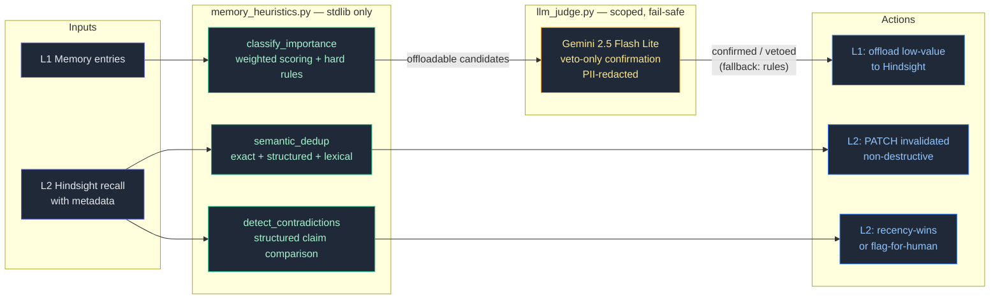

# agent-memory-optimization

A Hermes Agent skill for maintaining a three-layer AI agent memory system: **L1** local always-injected memory, **L2** semantic recall (Hindsight), **L3** compiled knowledge (Karpathy-pattern LLM Wiki / OKF bundle).

Grounded in 2026 agent-memory research: consolidation policy (importance, merge, decay, eviction) — not retrieval — is where production memory systems fail. An agent that remembers everything is an agent that remembers nothing useful.

## Why

Long-running agents accumulate:
- **Memory pollution** — stale facts retrieved with full confidence (the Postgres→MySQL entity-drift failure)
- **Semantic duplicates** — near-identical memories that evade exact-match dedup and waste retrieval slots
- **Index bloat** — add-all agents measured at 13% accuracy vs 39% for curated agents (3× worse)

This skill is the maintenance playbook: write-time importance filtering, semantic dedup passes, contradiction resolution (recency wins for state, flag-for-human for stable attributes), tiered TTL, and eviction-for-compliance-only.

## v3.2 — Scoped LLM Judge for the Offload Gate (Sep 2026)

v3.0 replaced all LLM-as-judge operations with deterministic rules. v3.2 reintroduces a **scoped** LLM judge for exactly one decision point: the L1 → L2 offload gate (`scripts/llm_judge.py`, Gemini 2.5 Flash Lite via OpenRouter).

- **Rules stay the hard gate** — the judge only reviews entries the heuristics already marked OFFLOADABLE, and can only **veto** an offload (keep in L1); it can never unlock one. Quarantined, pinned, and essential-prefix entries never reach the judge.
- **Fail-safe** — any judge failure (no key, API down, timeout, parse error) falls back to the full rule-based offload set. `JUDGE_ENABLED=0` disables it with zero network calls.
- **Privacy** — content is PII-redacted; sensitive/credential-like entries are never sent to the cloud judge and keep their rule-based verdict.
- **Attribution** — OpenRouter calls carry `X-Title`/`HTTP-Referer` set to the project name, never localhost.

Config: `JUDGE_MODEL` (default `google/gemini-2.5-flash-lite`), `JUDGE_TIMEOUT` (30s), `JUDGE_MAX_ENTRIES` (40), `JUDGE_TEMPERATURE` (0). Key resolution: `OPENROUTER_API_KEY` env var → `~/.hermes/.env`.

## v3.0 — Rule-Based Heuristics (Sep 2026)

Replaces all LLM-as-judge operations with **deterministic, local rule-based heuristics**. Zero external chat-completion calls. Standard library only.

| Operation | Old (v2.x) | New (v3.0) |
|-----------|-----------|-----------|
| Importance classification | LLM batched call | Weighted scoring rules + hard keep/offload overrides |
| Semantic dedup | LLM identifies same-fact-different-wording | SHA-256 exact hash + structured claim matching + Jaccard/containment thresholds |
| Contradiction detection | LLM finds entity-drift pairs | Structured claim extraction; recency_wins only with reliable chronology |
| Issue auto-resolution | LLM selects API actions | Fixed remediation allowlist (7 action types) |

**Key improvements over v2.x**:
- Zero token cost, zero external API calls
- Deterministic: identical input → identical output
- Indexed candidate generation — no O(n²) pair comparison
- Cross-batch dedup coverage (old LLM chunked approach missed duplicates across batches)
- Timestamp safety: recall order never treated as chronological order
- Transactional offload: failed L2 retains never cause L1 data loss
- Dry-run mode and full audit logging

**Non-destructive invalidation**: dedup and contradiction resolution use `PATCH {"state":"invalidated"}` (recall-hidden, retained on disk for audit). Never `DELETE`.

### Architecture



## Layer topology

| Layer | Store | Holds | Rule of thumb |
|-------|-------|-------|---------------|
| L1 | MEMORY.md / USER.md (~2-4 KB) | Facts needed every turn | "must know this turn" |
| L2 | Hindsight (localhost:8888) | Episodes, preferences, decisions | "recall when relevant" |
| L3 | LLM Wiki / OKF bundle (git) | Compiled knowledge with sources | "synthesized, cited, versioned" |

A fact living in two layers belongs in the deepest layer that surfaces it reliably.

## Install

Copy into your Hermes skills directory:

```bash
git clone https://github.com/Green-Needle-Tech/agent-memory-optimization.git
cp -r agent-memory-optimization/SKILL.md ~/.hermes/skills/productivity/memory-optimization/
cp agent-memory-optimization/scripts/*.py ~/.hermes/scripts/
```

Requires a Hermes Agent instance. The L2 procedure targets a [Hindsight](https://hindsight.vectorize.io) (Vectorize.io) server; the L3 procedure targets a Karpathy-pattern LLM Wiki. Both layers are optional — the L1 procedure works standalone.

### Environment variables

All locations are resolved from the *existing* deployment, not just the current user's home (`scripts/paths.py`, v3.3). Resolution chains (first hit wins):

- **`HERMES_HOME`**: env var (explicit, always wins) → this script's own deployment dir (`<parent>/scripts/..`, validated by Hermes markers) → `~/.hermes` → first existing `/home/*/.hermes` with Hermes markers (covers root cron jobs against another user's install) → `~/.hermes` fallback.
- **`HINDSIGHT_URL` / `HINDSIGHT_BANK`**: env var → `$HERMES_HOME/hindsight/config.json` (`api_url` / `bank_id`) → `http://localhost:8888` / `main`.
- **Env values (`OPENROUTER_API_KEY`, `TELEGRAM_BOT_TOKEN`, ...)**: process env → `$HERMES_HOME/.env` → `~/.hermes/.env`.
- **`WIKI_DIR`**: env var → `<Hermes user's home>/wiki` (`HERMES_HOME.parent/wiki`) → `~/wiki`.

| Variable | Default | Description |
|---|---|---|
| `HERMES_HOME` | location-aware (see above) | Hermes config/data directory |
| `WIKI_DIR` | location-aware (see above) | Static LLM wiki directory (L3) |
| `KB_DIR` | `$HERMES_HOME/kb` | SA-Copilot knowledge bundle (L3) |
| `MEMORY_FILE` | `$HERMES_HOME/memories/MEMORY.md` | L1 memory file |
| `USER_FILE` | `$HERMES_HOME/memories/USER.md` | L1 user profile file |
| `HINDSIGHT_URL` | `$HERMES_HOME/hindsight/config.json` → `http://localhost:8888` | Hindsight API endpoint (L2) |
| `HINDSIGHT_BANK` | `$HERMES_HOME/hindsight/config.json` → `main` | Hindsight bank name |
| `MEMORY_CHARS` | `2200` | L1 MEMORY.md char cap |
| `USER_CHARS` | `1375` | L1 USER.md char cap |
| `MEMORY_HEURISTICS_DRY_RUN` | (unset) | Set to `1` to enable dry-run mode |
| `JUDGE_ENABLED` | `1` | `0` disables the LLM offload judge (zero network calls) |
| `JUDGE_MODEL` | `google/gemini-2.5-flash-lite` | OpenRouter model for the offload judge |
| `OPENROUTER_API_KEY` | `$HERMES_HOME/.env` → `~/.hermes/.env` | Judge API key (env var wins; judge auto-disabled when absent) |

### Optional configuration

`~/.hermes/memory_heuristics.json` — user overrides for essential prefixes, offload patterns, and state attributes. Invalid configuration falls back to defaults with a warning.

```json
{
  "essential_prefixes": ["Production API:", "Customer response policy:"],
  "offload_patterns": ["\\bcompleted ticket\\b"],
  "state_attributes": ["provider", "model", "url", "port", "version"],
  "dry_run": false
}
```

## Procedure (summary)

1. **Assess** — L1 capacity %, L2 node count + failed operations, L3 size
2. **L1 prune + offload** — classify essential vs offloadable (weighted rules), dedup-check against L2, retain, batch-remove, densify
3. **L2 maintenance** — heuristic dedup pass (exact + strong), contradiction scan, consolidate + recall-verify
4. **L3 lint** — orphans, broken wikilinks, index drift, staleness, contradiction handling with provenance
5. **Report** — per-layer changes + memory-health verdict

Full details, pitfalls, and API commands: see [SKILL.md](SKILL.md).

## Key findings baked in

- Write time is the cheapest quality gate — everything retained is retrieved and judged forever
- Semantic dedup typically shrinks polluted stores 30–40% with no information loss
- Tiered TTL: immutable facts → infinite; procedural → months; preferences → weeks; transient → hours
- Consolidation can over-prune — always recall-verify after triggering it
- Deterministic rules eliminate runtime variability and token cost

## L2 ↔ L3 bridge (Aug 2026 research)

Hindsight and the LLM Wiki are complementary: Hindsight is a memory engine (auto fact extraction, entity graph, TEMPR retrieval — semantic + BM25 + graph + temporal, consolidation that reconciles contradictions); the wiki is a compiled artifact (synthesized once, kept current). Four integration patterns:

1. **Pointer retention** — retain wiki page refs (title, path, topic tags) into Hindsight; recall surfaces the pointer, the agent opens the page. Cheapest; keeps L2/L3 separation clean. Default.
2. **Wiki as curated raw layer** — ingest wiki pages via Hindsight's documents API; gains temporal + multi-hop + auto contradiction reconciliation. For high-value corpora only.
3. **Dual-store role separation** — wiki for compiled domain knowledge (index-first), Hindsight for operational/temporal memory. The pattern this repo's topology table describes.
4. **Knowledge Pages (Hindsight ≥ v0.9)** — Hindsight projects its own wiki: `hindsight fs mount` renders self-updating markdown pages built from consolidated observations. A page is a projected view over memory, not storage — delete it and it re-projects. No lint needed for contradictions; page health rides on the same failed-operations checks as L2.

Full detail in [SKILL.md](SKILL.md) § "L2 ↔ L3 Bridge".

## Daily cron automation

The repo ships the no-agent daily script (`scripts/daily_memory_optimization.py`, targets Hindsight 0.8+ — Knowledge Pages checks activate automatically on 0.9+):

1. Trigger L2 consolidation and poll it to completion (max 8 min)
2. Recall smoke-test (consolidation over-prune check)
3. Retain smoke-test — `total_tokens > 0` proves fact extraction ran (health green ≠ writes working)
4. Bank stats: node count + failed_operations trend vs last run
5. Remove expired smoke-test records (self-pollution cleanup)
6. Remove meta-maintenance records (reports about past runs)
7. **Heuristic dedup pass** (v3.0): exact (SHA-256) + strong (structured claim / high lexical threshold) duplicates detected across the full recall set; invalidated via PATCH (non-destructive)
8. Re-fetch/filter invalidated records
9. **Contradiction scan** (v3.0): structured claim extraction; recency_wins only for high-confidence state changes with reliable chronology; stable and uncertain conflicts flagged for human review
10. Knowledge Pages health: warn when >50% of pages report `is_stale` (Hindsight ≥0.9; tree signal is bank-wide-approximate, so small KBs ≤25 pages get exact per-page mental-model checks; skipped silently on older versions)
11. L1 capacity check (≥90% warns / triggers Hindsight offload — rule-based classification)
12. **L3 stale-page lint trigger** (v3.1): ≥5 active pages >90 days stale (frontmatter `updated` with mtime fallback; `_archive/` and index pages excluded; strictly >90) runs one read-only lint pass — `llmwiki lint --wiki-dir <dir> --json`, falling back to `python3 -m llmwiki lint`, 5-minute timeout, no LLM-powered rules. The JSON report is summarized: pages scanned, error/warning/info counts, up to 3 representative issues. Missing CLI, timeout, malformed output, and nonzero exit are reported as unresolved issues without crashing the run.
13. **Rule-based auto-resolve** (v3.0): if any issues were collected, attempt to resolve them with the fixed remediation allowlist (7 action types). Destructive actions (invalidate) are disabled by default — pass `--allow-destructive` or `--apply` to enable.
14. **Telegram notification**: if any issues remain unresolved after rule-based remediation, send a DM to the user. HTML content is escaped. Delivery status is reported accurately. Silent if all issues are resolved or no issues found.

Silent on success — output only when something needs attention. Deploy next to `memory_offload.py` in `~/.hermes/scripts/` and schedule as a no-agent cron.

### CLI flags

| Flag | Description |
|------|-------------|
| `--dry-run` | Report issues without taking any action (also via `MEMORY_HEURISTICS_DRY_RUN=1`) |
| `--apply` | Apply all recommended actions (implies `--allow-destructive`) |
| `--allow-destructive` | Enable auto-mutation (invalidate) — default: disabled |
| `--restore MEMORY_ID` | Restore a previously invalidated memory from the audit log |
| `--audit-log` | Print recent audit log entries |

### Pipeline flowchart

```mermaid
flowchart TD
    START([Daily cron triggers]) --> L2A[L2: POST /consolidate]
    L2A --> POLL{Operation<br/>completed?}
    POLL -- no, ≤8 min --> POLL
    POLL -- timeout / error --> ERR
    POLL -- completed --> L2B[L2: Recall smoke-test<br/>over-prune check]
    L2B --> L2C[L2: Retain smoke-test<br/>success AND total_tokens > 0]
    L2C --> L2D[L2: Bank stats<br/>nodes > 0, failed_ops trend]

    L2D --> CLEAN[Clean expired smoke-tests<br/>+ meta-maintenance records]
    CLEAN --> DEDUP[Heuristic dedup pass<br/>exact + strong, cross-batch]
    DEDUP --> CONTRA[Contradiction scan<br/>structured claims, recency_wins<br/>high-confidence only]
    CONTRA --> KP{Hindsight ≥ 0.9?<br/>/knowledge-base/tree}
    KP -- "404 / < 0.9" --> L1A
    KP -- ok --> KP2{KB ≤ 25 pages?}
    KP2 -- yes --> KP3["Exact per-page check<br/>GET /mental-models/{id}"]
    KP2 -- no --> KP4[Tree is_stale<br/>bank-wide approximation]
    KP3 --> KP5{> 50% pages stale?}
    KP4 --> KP5
    KP5 -- yes --> COLLECT[Collect issue]
    KP5 -- no --> L1A

    L1A[L1: MEMORY.md / USER.md<br/>capacity check] --> L1B{MEMORY.md<br/>≥ 90%?}
    L1B -- yes --> OFF[Run memory_offload.py<br/>offload to Hindsight]
    L1B -- no --> L3A
    OFF --> L3A

    L3A[L3: Stale-page scan<br/>~/.hermes/kb] --> L3B{≥ 5 active pages<br/>> 90 days stale?}
    L3B -- yes --> LINT[Run llmwiki lint --json<br/>5-min timeout, read-only]
    LINT --> COLLECT[Collect: summary +<br/>failure issues]
    L3B -- no --> OUT{Any issues<br/>collected?}
    COLLECT --> OUT

    OUT -- yes --> RESOLVE[Rule-based auto-resolve<br/>fixed allowlist, one pass]
    RESOLVE --> RESOLVED{All issues<br/>resolved?}
    RESOLVED -- yes --> SILENT([Silent: empty stdout<br/>exit 0])
    RESOLVED -- no --> TG([Send Telegram DM<br/>to user])
    OUT -- no --> SILENT
    ERR --> OUT

    classDef layer fill:#1f2937,stroke:#6366f1,color:#e5e7eb
    classDef decision fill:#1f2937,stroke:#f59e0b,color:#e5e7eb
    classDef warn fill:#1f2937,stroke:#ef4444,color:#fca5a5
    classDef resolve fill:#1f2937,stroke:#10b981,color:#a7f3d0
    classDef done fill:#1f2937,stroke:#10b981,color:#a7f3d0
    classDef tg fill:#1f2937,stroke:#3b82f6,color:#93c5fd
    class L2A,L2B,L2C,L2D,CLEAN,DEDUP,CONTRA,KP3,KP4,L1A,L3A,OFF,LINT,COLLECT layer
    class POLL,KP,KP2,KP5,L1B,L3B,OUT,RESOLVED decision
    class ERR,RESOLVE warn
    class START,SILENT done
    class TG tg
```



**Key invariants**
- Health green ≠ writes working — the retain smoke-test (`total_tokens > 0`) catches silent LLM-layer failures
- Exit 0 always; errors surface via stdout, never via nonzero exit
- Heuristic passes (dedup, contradictions) are deterministic and local — zero external chat-completion calls
- The offload judge (v3.2) is scoped and fail-safe: rules gate first, the judge can only veto, and any judge failure falls back to the rule-based verdict
- Safety invariant: an entry may be removed from L1 only after durable L2 retention or verified existing L2 presence
- Conservative mutation: only exact and strong duplicates are auto-invalidated; possible duplicates are report-only
- Timestamp safety: recall order is never treated as chronological order; recency_wins requires reliable timestamps or explicit transitions
- Stable attributes (legal name, birth date) are never auto-resolved — always flagged for human review
- Every mutation is logged to the audit log with rule ID, confidence, reason, and timestamp

## Sources

- [The Consolidation Problem in Agent Memory](https://hindsight.vectorize.io/blog/2026/05/21/agent-memory-consolidation) (Hindsight, May 2026)
- [Agent Memory Garbage Collection](https://tianpan.co/blog/2026-04-14-agent-memory-garbage-collection) (Apr 2026)
- [Agent Memory vs RAG: What Breaks at Scale](https://ranksquire.com/2026/03/31/agent-memory-vs-rag-what-breaks-at-scale-2026/) (Mar 2026)
- [Selective Retention and Forgetting Strategies](https://zylos.ai/en/research/2026-06-08-agent-memory-consolidation-selective-retention-forgetting/) (Zylos, Jun 2026)
- [Human-Inspired Memory Architecture](https://arxiv.org/html/2605.08538v1) — dedup-based consolidation: 97.2% precision, 58% store reduction
- [SCM: Sleep-Consolidated Memory](https://arxiv.org/html/2604.20943v1) — structured forgetting for LLM memory
- [Agent Memory Techniques](https://github.com/NirDiamant/Agent_Memory_Techniques) — 30 runnable notebooks covering consolidation, compaction, forgetting

## License

MIT
