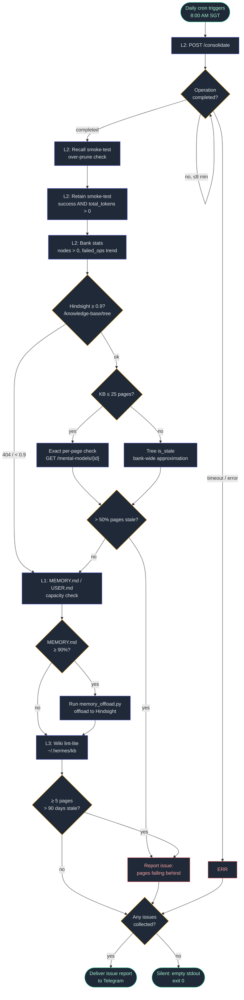

# agent-memory-optimization

A Hermes Agent skill for maintaining a three-layer AI agent memory system: **L1** local always-injected memory, **L2** semantic recall (Hindsight), **L3** compiled knowledge (Karpathy-pattern LLM Wiki / OKF bundle).

Grounded in 2026 agent-memory research: consolidation policy (importance, merge, decay, eviction) — not retrieval — is where production memory systems fail. An agent that remembers everything is an agent that remembers nothing useful.

## Why

Long-running agents accumulate:
- **Memory pollution** — stale facts retrieved with full confidence (the Postgres→MySQL entity-drift failure)
- **Semantic duplicates** — near-identical memories that evade exact-match dedup and waste retrieval slots
- **Index bloat** — add-all agents measured at 13% accuracy vs 39% for curated agents (3× worse)

This skill is the maintenance playbook: write-time importance filtering, semantic dedup passes, contradiction resolution (recency wins for state, flag-for-human for stable attributes), tiered TTL, and eviction-for-compliance-only.

## Layer topology

| Layer | Store | Holds | Rule of thumb |
|-------|-------|-------|---------------|
| L1 | MEMORY.md / USER.md (~2-4 KB) | Facts needed every turn | "must know this turn" |
| L2 | Hindsight (localhost:8888) | Episodes, preferences, decisions | "recall when relevant" |
| L3 | LLM Wiki / OKF bundle (git) | Compiled knowledge with sources | "synthesized, cited, versioned" |

A fact living in two layers belongs in the deepest layer that surfaces it reliably.

## Install

Copy into your Hermes skills directory:

```bash
git clone https://github.com/david6055my/agent-memory-optimization.git
cp -r agent-memory-optimization/SKILL.md ~/.hermes/skills/productivity/memory-optimization/
```

Requires a Hermes Agent instance. The L2 procedure targets a [Hindsight](https://hindsight.vectorize.io) (Vectorize.io) server; the L3 procedure targets a Karpathy-pattern LLM Wiki. Both layers are optional — the L1 procedure works standalone.

## Procedure (summary)

1. **Assess** — L1 capacity %, L2 node count + failed operations, L3 size
2. **L1 prune + offload** — classify essential vs offloadable, dedup-check against L2, retain, batch-remove, densify
3. **L2 maintenance** — semantic dedup pass, contradiction scan, consolidate + recall-verify, config tune
4. **L3 lint** — orphans, broken wikilinks, index drift, staleness, contradiction handling with provenance
5. **Report** — per-layer changes + memory-health verdict

Full details, pitfalls, and API commands: see [SKILL.md](SKILL.md).

## Key findings baked in

- Write time is the cheapest quality gate — everything retained is retrieved and judged forever
- Semantic dedup typically shrinks polluted stores 30–40% with no information loss
- Tiered TTL: immutable facts → infinite; procedural → months; preferences → weeks; transient → hours
- Consolidation can over-prune — always recall-verify after triggering it

## L2 ↔ L3 bridge (Aug 2026 research)

Hindsight and the LLM Wiki are complementary: Hindsight is a memory engine (auto fact extraction, entity graph, TEMPR retrieval — semantic + BM25 + graph + temporal, consolidation that reconciles contradictions); the wiki is a compiled artifact (synthesized once, kept current). Four integration patterns:

1. **Pointer retention** — retain wiki page refs (title, path, topic tags) into Hindsight; recall surfaces the pointer, the agent opens the page. Cheapest; keeps L2/L3 separation clean. Default.
2. **Wiki as curated raw layer** — ingest wiki pages via Hindsight's documents API; gains temporal + multi-hop + auto contradiction reconciliation. For high-value corpora only.
3. **Dual-store role separation** — wiki for compiled domain knowledge (index-first), Hindsight for operational/temporal memory. The pattern this repo's topology table describes.
4. **Knowledge Pages (Hindsight ≥ v0.9)** — Hindsight projects its own wiki: `hindsight fs mount` renders self-updating markdown pages built from consolidated observations. A page is a projected view over memory, not storage — delete it and it re-projects. No lint needed for contradictions; page health rides on the same failed-operations checks as L2.

Full detail in [SKILL.md](SKILL.md) § "L2 ↔ L3 Bridge".

## Daily cron automation

The repo ships the no-agent daily script (`scripts/daily_memory_optimization.py`, targets Hindsight 0.8+ — Knowledge Pages checks activate automatically on 0.9+):

1. Trigger L2 consolidation and poll it to completion (max 8 min)
2. Recall smoke-test (consolidation over-prune check)
3. Retain smoke-test — `total_tokens > 0` proves fact extraction ran (health green ≠ writes working)
4. Bank stats: node count + failed_operations trend vs last run
5. Knowledge Pages health: warn when >50% of pages report `is_stale` (Hindsight ≥0.9; tree signal is bank-wide-approximate, so small KBs ≤25 pages get exact per-page mental-model checks; skipped silently on older versions)
6. L1 capacity check (≥90% warns / triggers Hindsight offload)
7. L3 wiki lint-lite (≥5 pages >90 days stale warns)

Silent on success — output only when something needs attention. Deploy next to `memory_offload.py` in `~/.hermes/scripts/` and schedule as a no-agent cron.

### Pipeline flowchart



**Key invariants**
- Health green ≠ writes working — the retain smoke-test (`total_tokens > 0`) catches silent LLM-layer failures
- Exit 0 always; errors surface via stdout, never via nonzero exit
- The script's own smoke-test retain means a small Knowledge Base always reads stale in the tree — hence the exact per-page mental-model check for KBs ≤ 25 pages

### Sample report (agent-driven run)

The no-agent cron is silent on success, but the same pipeline can also run agent-driven with a full report. Example output from a real run (Aug 24, 2026):

```text
🧠 Daily Memory Optimization Report
Run: 2026-08-24 (Mon, SGT) | Bank: hermes

Step 0 — Assessment
• L1 MEMORY.md: 85% (1,881/2,200) — ⚠️ over 75% threshold
• L1 USER.md: 50% (700/1,375) — ✅ healthy
• L2 Hindsight: 1,641 nodes, 351 failed ops — ⚠️ investigated
• L3 Wiki: 204K, 31 .md files (28 content) — ✅ clean

Step 1 — L1 Prune + Densify
• 2 entries densified in one atomic batch (270→220 chars; L3 entry
  reduced to path + skill reference — detail already in Hindsight)
• MEMORY.md: 85% → 73% (−264 chars, −12%); USER.md unchanged
• Remaining 9 entries all durable, high-signal conventions — no offload

Step 2 — L2 Hindsight Maintenance
• 351 failed ops: all 402 Insufficient credits from pre-key-rotation
  window — no active failures ✅
• 179 failed consolidations: same 402 window; POST /consolidate →
  deduplicated: false (nothing pending) ✅
• Post-consolidation recall-verify: PASS
• Semantic dedup skipped (store cleaned Aug 12); no contradictions;
  config already optimal

Step 3 — L3 Wiki Lint
• Orphans: 0 · Broken [[links]]: 0 · Frontmatter: 28/28 valid
• Index: 28/28 · Staleness >90d: 0 · log.md: 39 entries
• 1 flag: reference/data-analytics.md at 447 lines exceeds the
  200-line guideline — held for user approval (6+ inbound links)

Step 4 — Verdict: 🟢 STABLE
No active contradictions, no pollution signals, recall precision
intact across all three layers.
```

Key takeaway: the 402 error burst looked alarming in raw failed-op counts but was a resolved transient (expired credits) — the investigation step prevents false alarms, and the report ends with exactly one actionable item requiring human sign-off rather than auto-splitting a heavily linked wiki page.

## Sources

- [The Consolidation Problem in Agent Memory](https://hindsight.vectorize.io/blog/2026/05/21/agent-memory-consolidation) (Hindsight, May 2026)
- [Agent Memory Garbage Collection](https://tianpan.co/blog/2026-04-14-agent-memory-garbage-collection) (Apr 2026)
- [Agent Memory vs RAG: What Breaks at Scale](https://ranksquire.com/2026/03/31/agent-memory-vs-rag-what-breaks-at-scale-2026/) (Mar 2026)
- [Selective Retention and Forgetting Strategies](https://zylos.ai/en/research/2026-06-08-agent-memory-consolidation-selective-retention-forgetting/) (Zylos, Jun 2026)

## License

MIT
