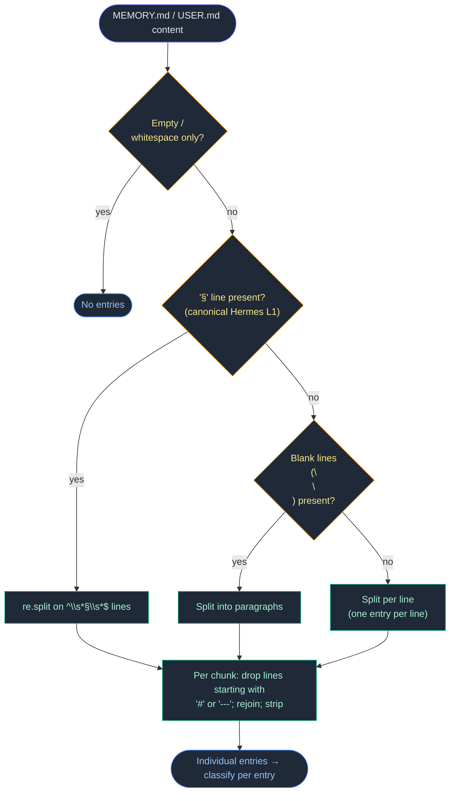
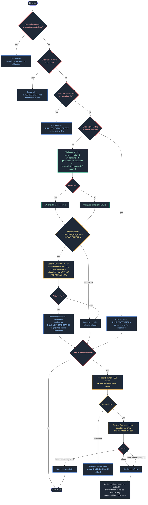

# agent-memory-optimization — Specification

Version: 3.6.3 (Sep 2026) · Author: Liew Wei Sung · License: MIT
Repo: https://github.com/Green-Needle-Tech/agent-memory-optimization

A Hermes Agent skill for maintaining a three-layer AI agent memory system: **L1** local always-injected memory (MEMORY.md / USER.md, ~2-4 KB), **L2** semantic recall (Hindsight, localhost:8888), **L3** compiled knowledge (Karpathy-pattern LLM Wiki / OKF bundle). Maintenance is grounded in 2026 agent-memory research: consolidation policy — importance, merge, decay, eviction — is where production memory systems fail, not retrieval.

## 1. Components

| Component | Role |
|---|---|
| `scripts/memory_heuristics.py` | Deterministic rule engine (stdlib only): L1 entry parsing (per-entry, never bulk), importance classification (hard rules + weighted scoring), semantic dedup, contradiction detection, audit logging, dry-run |
| `scripts/llm_judge.py` | Scoped TypeSafe Jev judge (System One, `jev-1.13.0`): importance refinement + veto-only offload gate, confidence-gated, fail-safe |
| `scripts/memory_offload.py` | Transactional L1 → L2 offload (cron, 30 min): rules gate first, Jev confirms/vetoes, entry removed only after durable L2 retention |
| `scripts/daily_memory_optimization.py` | No-agent daily cron: L2 consolidation + smoke-tests, dedup/contradiction passes, Knowledge Pages health, L1 capacity, L3 lint, rule-based auto-resolve, Telegram notify |
| `scripts/memory_records.py` | Record normalization, PII redaction, sensitive-entry exclusion, paginated scan batches |
| `scripts/paths.py` | Location-aware resolution (HERMES_HOME, Hindsight URL/bank, .env values, WIKI_DIR) from the existing deployment |

## 2. L1 entry parsing (v3.6.3)

Every decision in this spec operates on **individual L1 entries, never on a file in bulk**. `memory_heuristics.parse_l1_entries()` is the single parser for MEMORY.md and USER.md, used by `memory_offload.read_memory_file` / `get_memory_usage` and the daily script's `prune_user_md`. Separator precedence (first match wins), with header/rule-line filtering inside each chunk:



**Why**: the pre-v3.6.3 parsers split only on `§`; a file without `§` collapsed into a single bulk entry, so classification, offload, and USER.md pruning all judged the whole file as one unit — one hard-offload pattern match could flag the entire file. The parser is deterministic and pure (no I/O), so callers keep their own atomic-write and locking guarantees.

## 3. Decision pipeline (v3.6)

Every L1 entry passes through two stages. The rule engine is the hard gate; the Jev judge is a scoped, fail-safe refinement layer that can never override a hard rule.



## 4. Jev judge contract

**Endpoint**: `POST https://api.typesafe.ai/v1/systemone` · **Model**: `jev-1.13.0` · **Auth**: `Bearer TYPESAFE_API_KEY` (env → `$HERMES_HOME/.env` → `~/.hermes/.env`) · **Attribution**: `X-Title`/`HTTP-Referer` = `Green-Needle-Tech/agent-memory-optimization`.

Request shape (one atomic choice question per entry, all evaluated in parallel against the same state):

```json
{
  "model": "jev-1.13.0",
  "state": "0: <PII-redacted entry>\n1: <PII-redacted entry>",
  "questions": {
    "e0": {
      "type": "choice",
      "instructions": "<decision instructions>",
      "criteria": {
        "essential": "WHAT: ... NOT FOR: ... EXAMPLES: ...",
        "offloadable": "WHAT: ... NOT FOR: ... EXAMPLES: ..."
      }
    }
  }
}
```

Response: `answers.{qid}` → `{choice, confidence, probabilities}` (distribution sums to 1).

**Decision points and authority**

| Decision point | Input set | Jev authority | Guard |
|---|---|---|---|
| Importance (`judge_importance`) | Weighted-band entries only (no hard rule matched) | Reclassify essential ↔ offloadable | Hard-gated entries never sent; unknown choices ignored; audited as `RULE_JEV_IMPORTANCE` |
| Offload gate (`judge_offload_candidates`) | Rule-offloadable entries only | Veto an offload (keep in L1) — never unlock | Veto applies only at confidence ≥ `JUDGE_MIN_CONFIDENCE` (0.6); unsent entries keep rule verdict |

**Fail-safe matrix** — every failure mode degrades to the rule-based result:

| Condition | Importance | Offload gate |
|---|---|---|
| `JUDGE_ENABLED=0` or no key | rule verdicts, status `disabled` | all confirmed, status `disabled` |
| No safe candidates (all sensitive/empty) | `skipped` | all confirmed, status `skipped` |
| Network/HTTP/timeout/malformed answers | rule verdicts, status `fallback` | all confirmed, status `fallback` |
| Unknown choice value | entry keeps rule verdict | entry keeps rule verdict (offload) |
| Low-confidence keep (< 0.6) | n/a (no confidence gate on importance) | ignored — offload stands |

**Privacy**: content PII-redacted (`memory_records.redact_pii`) and truncated to 300 chars before sending; entries flagged sensitive (`should_exclude_from_judging`: credential-like content/tags) never leave the host and keep their rule verdict.

**Live-verified behavior (Sep 2026)**: importance questions return sharply separated distributions (essential 0.85 / offloadable 0.15, confidence 0.69–0.73); gate questions on ambiguous entries return near-even distributions (confidence 0.08–0.17) which the confidence gate correctly suppresses — the rules stay in charge exactly when Jev signals "I don't know". Full test case in README § v3.6.

## 5. Deterministic rule engine

**Importance**: hard keep (+100: pin, essential prefix), hard offload (−100: explicit tag, offload pattern), quarantine (secret-like), weighted scoring otherwise (threshold ≥ 3 → essential). User-configurable via `$HERMES_HOME/memory_heuristics.json`.

**Semantic dedup** (indexed candidates, no O(n²)): `exact` (SHA-256 of normalized content) and `strong` (same structured claim, or Jaccard ≥ 0.82 + containment ≥ 0.92 + identical protected values) auto-invalidate via `PATCH {"state":"invalidated"}` (non-destructive); `possible` is report-only. Protected values (URLs, ports, IPs, versions, dates) differing ⇒ never duplicates. Canonical selection: pinned → provenance → more complete → newer → lower index.

**Contradictions**: structured claim extraction (subject/attribute/value syntax patterns). State attributes (provider, model, url, port, version, status, database): `recency_wins` only with reliable timestamps or explicit transition syntax; otherwise `flag_human`. Stable attributes (legal name, birth date, account ID): always `flag_human`. Complementary facts are not contradictions. Recall order is never chronological order.

**Auto-resolve allowlist** (fixed, no LLM): `L2_CONSOLIDATION_PENDING` → trigger_consolidation; `L1_CAPACITY_EXCEEDED` → run_memory_offload; `SMOKE_TEST_EXPIRED` / `META_MEMORY_FOUND` / `EXACT_DUPLICATE` / `STRONG_DUPLICATE` → invalidate_exact_memory_id; `STATE_CHANGE_HIGH_CONFIDENCE` → invalidate_exact_older_memory_id; `SMOKE_TEST_CLEANUP` / `META_MEMORY_CLEANUP` / `POSSIBLE_DUPLICATE_REPORT` / `L3_LINT_REPORT` → mark_resolved; `KP_PAGES_STALE` → trigger_consolidation; `L1_USER_NEAR_CAPACITY` → prune_user_md. Destructive actions require `--allow-destructive` / `--apply`.

## 6. Safety invariants

1. An entry is removed from L1 only after confirmed L2 presence or successful L2 retain — failed entries always kept.
2. Hard rules always outrank the Jev judge; the judge is an enhancement, never a dependency.
3. Non-destructive invalidation only (`PATCH invalidated`); never `DELETE`. Eviction (bank purge) is compliance-only.
4. Atomic MEMORY.md rewrites (temp file + fsync + os.replace) with rotating backups; advisory file lock prevents concurrent offload/daily runs.
5. Every mutation is audit-logged (JSONL: operation, memory_id, rule_id, confidence, reason, timestamp); secret-like content never logged.
6. Dry-run mode (`MEMORY_HEURISTICS_DRY_RUN=1` / `--dry-run`) reports proposed actions with rule identifiers, never mutates.
7. Daily cron: exit 0 always; errors surface via stdout; silent on success.

## 7. Configuration

| Variable | Default | Description |
|---|---|---|
| `JUDGE_ENABLED` | `1` | `0` disables the Jev judge (zero network calls) |
| `JUDGE_MODEL` | `jev-1.13.0` | TypeSafe System One model |
| `JUDGE_TIMEOUT` | `30` | Request timeout (seconds) |
| `JUDGE_MAX_ENTRIES` | `40` | Max entries per judge call |
| `JUDGE_MIN_CONFIDENCE` | `0.6` | Minimum confidence for a KEEP veto to apply |
| `TYPESAFE_API_KEY` | location-aware | TypeSafe API key; judge auto-disabled when absent |
| `MEMORY_CHARS` / `USER_CHARS` | `2200` / `1375` | L1 char caps |
| `OFFLOAD_THRESHOLD` | `0.75` | L1 usage that triggers offload |
| `MEMORY_HEURISTICS_DRY_RUN` | unset | `1` = dry-run mode |

Location resolution (v3.3): `HERMES_HOME` env → deployment dir (Hermes-marker validated) → `~/.hermes` → first `/home/*/.hermes` with markers; `.env` values: process env → `$HERMES_HOME/.env` → `~/.hermes/.env`; Hindsight URL/bank: env → `$HERMES_HOME/hindsight/config.json` → defaults.

## 8. Test coverage

194 tests + 2 live-API smokes (auto-skip without `TYPESAFE_API_KEY`): key resolution, availability gating, fail-safe on every failure mode, veto-only semantics, confidence gate, PII redaction / sensitive exclusion, hard-gate isolation, attribution headers, System One payload shape, integration through `memory_offload.classify_entries`, and live `jev-1.13.0` calls for both decision points.

## 9. References

- TypeSafe System One / Choice primitive: docs.typesafe.ai (state + typed questions → typed answers with probability distributions; confidence as the act/no-act axis)
- Hindsight: hindsight.vectorize.io — consolidation, Knowledge Pages, TEMPR retrieval
- Consolidation research summary: README § v3.6.3, § Sources
